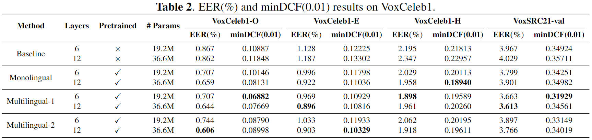
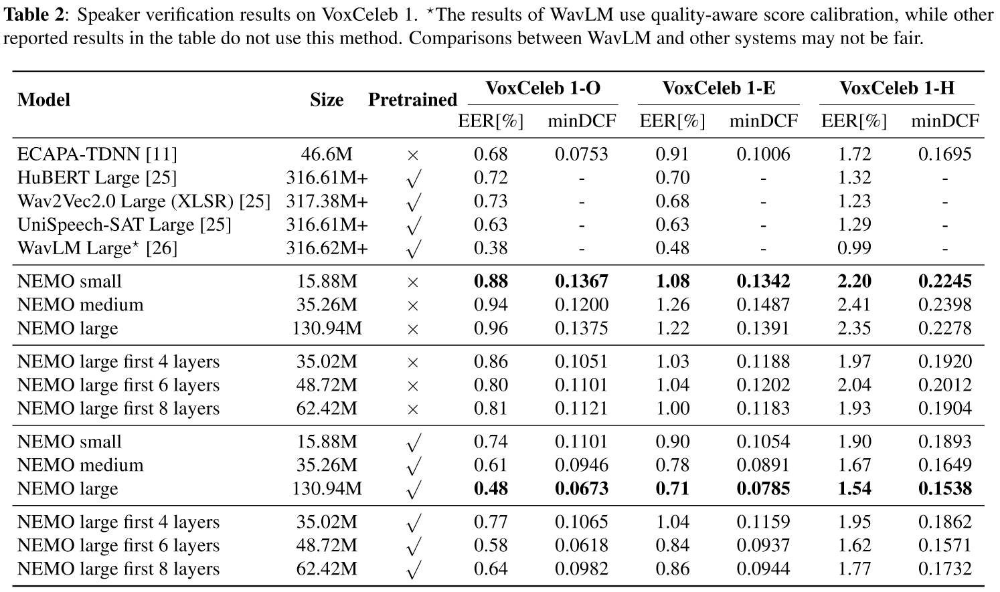

# multilingual-phonetic-sv

## Language analysis of the VoxCeleb2 dev dataset
We used a language identification model (https://huggingface.co/TalTechNLP/voxlingua107-epaca-tdnn) to analyze the language of the utterances in the VoxCeleb2 dev dataset. The number of utterances for each language can be found in [lang.txt](results/lang.txt).

## Comparison of methods
1.Results in this paper



2.Results in [Pretraining Conformer with ASR for Speaker Verification](https://ieeexplore.ieee.org/document/10096659)




## Installation
1.Created your a Python 3.9 environment.
```bash
conda create -n sre python=3.9
```
2.Pytorch
```bash
conda install pytorch==1.12.1 torchvision==0.13.1 torchaudio==0.12.1 cudatoolkit=11.3 -c pytorch
```
3.Install required packages
```bash
git clone https://github.com/zds-potato/multilingual-phonetic-sv.git
cd multilingual-phonetic-sv
pip -r requirements.txt
```


## Acknowledge
We borrowed a lot of code from:
1. [mfa_conformer](https://github.com/zyzisyz/mfa_conformer) 
2. [sunine](https://gitlab.com/csltstu/sunine/-/tree/master)
3. [wespeaker](https://github.com/wenet-e2e/wespeaker)
4. [wenet](https://github.com/wenet-e2e/wenet)
5. [ECAPA-TDNN](https://github.com/TaoRuijie/ECAPA-TDNN)

## Other
We will open-source our trained multilingual speech recognition model soon...